# Autonomous Database Management Agent (ADMA)

**Powered by Model Context Protocol (MCP) & PostgreSQL**

An autonomous agent interface designed to manage DVD rental operations without human intervention. By exposing high-level operational tools via MCP, this server transforms a standard PostgreSQL database into an agent-accessible workspace, enabling LLMs to autonomously execute complex business workflows.

> **"Don't just query the database—manage the business."**

## 🤖 Core Capabilities

### 1. Autonomous Operations
Unlike passive query tools, ADMA is built for **action**. It can autonomously:
-   **Execute Transactions**: Process rentals usage `rent_movie` with built-in availability checks.
-   **Close Loops**: Handle returns via `return_movie` and update inventory status instantly.
-   **Resolve Entities**: Fuzzy search for films and customers to map natural language to specific IDs (`search_movies`, `get_customer_history`).

### 2. Intelligent State Awareness
The agent doesn't just read data; it understands **availability**.
-   Before renting, it proactively verifies stock levels (`get_available_inventory`).
-   It prevents invalid states (e.g., trying to rent an already-rented item).

### 3. Operational Analytics
Empowers the agent to optimize business decisions.
-   **Revenue Optimization**: `analyze_revenue` allows the agent to identify high-performing categories.
-   **Customer Profiling**: `get_customer_history` enables personalized interaction contexts.

## 🏗️ Agentic Architecture

```mermaid
graph TD
    UserReq["👤 User Request:<br/>'Rent The Matrix to John Doe'"] --> Agent[🤖 Autonomous Agent]
    
    subgraph "Phase 1: Entity Resolution (Read)"
        Agent -->|1. Find Customer| TC1[search_customers]
        TC1 -->|"Found: ID 35"| Agent
        Agent -->|2. Find Movie| TC2[search_movies]
        TC2 -->|"Found: ID 92"| Agent
    end

    subgraph "Phase 2: Validation (Read)"
        Agent -->|3. Check Stock| TC3[get_available_inventory]
        TC3 -->|"Inv IDs: [402, 403]"| Agent
    end

    subgraph "Phase 3: Execution (Write)"
        Agent -->|4. Rent| TC4[rent_movie]
        TC4 -->|"Success: Rental ID 1092"| Agent
    end

    %% Database Connections
    TC1 -.-> DB[(PostgreSQL)]
    TC2 -.-> DB
    TC3 -.-> DB
    TC4 -->|Commit| DB
    
    style Agent fill:#e1f5fe,stroke:#01579b,stroke-width:2px
    style UserReq fill:#fff3e0,stroke:#e65100,stroke-dasharray: 5 5
    style DB fill:#e8f5e9,stroke:#1b5e20,stroke-width:2px
```



## 🛠️ Toolset for Autonomy

The server exposes a suite of **deterministic tools** designed for reliable agent consumption:

| Tool Category | Tool Name | Agentic Purpose |
| :--- | :--- | :--- |
| **Discovery** | `search_movies` | Resolving vague user requests to concrete Film IDs. |
| **Discovery** | `search_customers` | Resolving user names to Customer IDs. |
| **Context** | `get_customer_history` | Understanding user context before acting. |
| **Logistics** | `get_available_inventory` | Verifying physical constraints before commitment. |
| **Action** | `rent_movie` | **State Mutation**: Committing a business transaction. |
| **Action** | `return_movie` | **State Mutation**: Closing a business lifecycle. |
| **Insight** | `analyze_revenue` | High-level feedback loop for optimization. |

## 🚀 Deployment

### Prerequisites
-   Python 3.12+
-   PostgreSQL instance (DVD Rental schema)
-   [MCP Client](https://github.com/modelcontextprotocol) (e.g., Claude Desktop or Cursor)

### Quick Start

1.  **Configure Environment**:
    Create a `.env` file with your DB credentials:
    ```env
    PG_HOST=localhost
    PG_PORT=5432
    PG_DB=dvdrental
    PG_USER=postgres
    PG_PASSWORD=secure_password
    ```

2.  **Install Agent Server**:
    ```bash
    pip install "mcp[cli]" psycopg2-binary python-dotenv
    ```

3.  **Activate Agent**:
    ```bash
    python main.py
    ```

## 🔒 Safety Protocols

Even autonomous agents need guardrails. ADMA implements strict safety measures:
-   **Scoped Mutations**: Agents can only modify data through strict logic gates (`rent`/`return`), preventing arbitrary data corruption.
-   **Read-Only Fallback**: Arbitrary SQL execution (`run_select_query`) is strictly confined to `SELECT` statements.

---

*Transform your database from a storage engine into an intelligent team member.*
